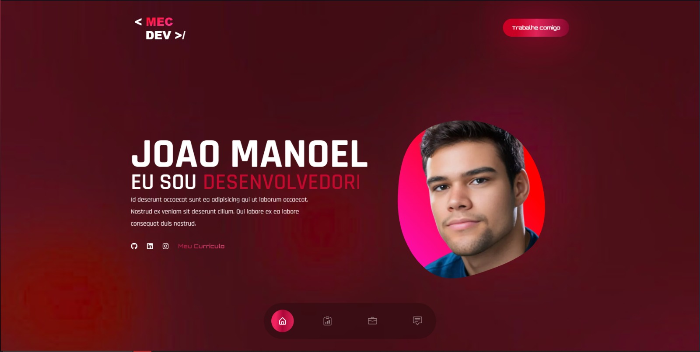

[English version below](#english-version)

# Portfólio Pessoal

Este é o repositório do meu portfólio pessoal, onde compartilho meus projetos, experiências e habilidades. Sinta-se à vontade para explorar o código e acessar a versão ao vivo para conhecer meu trabalho.

## Funcionalidades

- **Banner**: Uma breve apresentação.
- **Projetos**: Lista dos meus principais projetos com links para o GitHub.
- **Experiência**: Experiências profissionais relevantes.
- **Contato**: Meio de mandar email para mim, entrar em contato.

## Tecnologias Utilizadas

- React
- TypeScript
- Tailwind CSS

## Rodando o Projeto Localmente

1. Clone o repositório: `git clone https://github.com/merlinmec/portfolio.git`
2. Instale as dependências: `npm install`
3. Inicie o servidor: `npm start`

## Contato

- [LinkedIn](https://www.linkedin.com/in/joao-manoel-carvalho/)
- [Email](mailto:joaomanoel190701@gmail.com)

-----------------------------------------------------------------------------------------------------------------------------------------------------------------------
## {#english-version}

# Personal Portfolio 

This is the repository for my personal portfolio, where I share my projects, experiences, and skills. Feel free to explore the code and check out the live version to get to know my work.

## Features

- **Banner**: A brief introduction.
- **Projects**: A list of my main projects with links to GitHub.
- **Experience**: Relevant professional experiences.
- **Contact**: A way to send me an email and get in touch.

## Technologies Used

- React
- TypeScript
- Tailwind CSS

## Running the Project Locally

1. Clone the repository: `git clone https://github.com/merlinmec/portfolio.git`
2. Install the dependencies: `npm install`
3. Start the server: `npm start`

## Contact

- [LinkedIn](https://www.linkedin.com/in/joao-manoel-carvalho/)
- [Email](mailto:joaomanoel190701@gmail.com)