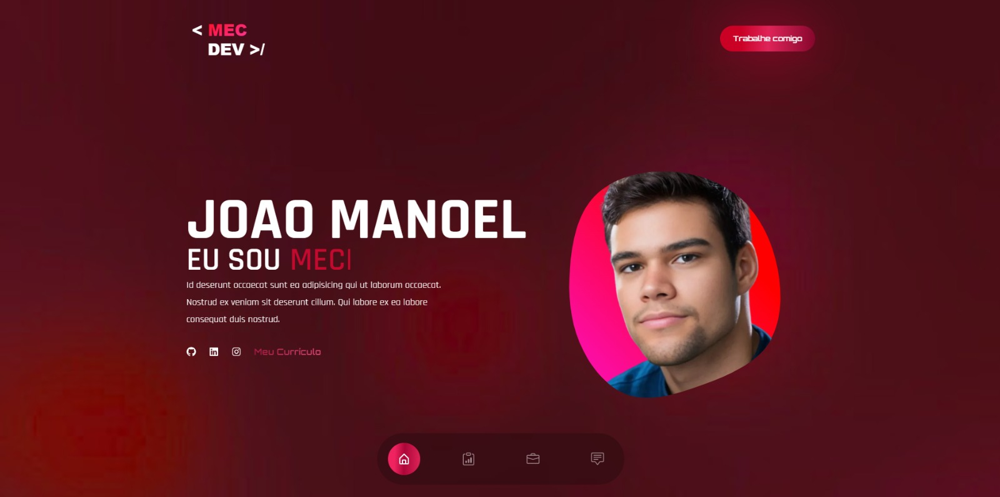

[English version below](#english-version)

# Portfólio Pessoal

Este é o repositório do meu portfólio pessoal, onde compartilho meus projetos, experiências e habilidades. Sinta-se à vontade para explorar o código e acessar a versão ao vivo para conhecer meu trabalho.

## Layout

Sidebar fixa (foto, nome, links) à esquerda e conteúdo rolável à direita, dividido nas seções:

- **Sobre**: Breve apresentação.
- **Experiência**: Timeline com experiências profissionais.
- **Projetos**: Listagem automática dos meus repositórios públicos no GitHub — veja abaixo como adicionar um novo.
- **Skills**: Tecnologias e ferramentas que utilizo.

### Como adicionar um projeto à listagem

A seção Projetos busca automaticamente, via API do GitHub, os repositórios públicos marcados com a topic `portfolio`. Para exibir um projeto no site, basta marcar essa topic no repositório correspondente no GitHub — não é necessário alterar nada no código.

## Tecnologias Utilizadas

- React
- Tailwind CSS
- Framer Motion

## Rodando o Projeto Localmente

=>Pré-requisitos: instalar Node.js (npm necessário)

1. Clone o repositório: `git clone https://github.com/merlinmec/portfolio.git`
2. Instale as dependências: `npm install`
3. Inicie o servidor: `npm start`

## Contato

- [LinkedIn](https://www.linkedin.com/in/joao-manoel-carvalho/)
- [Email](mailto:joaomanoel190701@gmail.com)

-----------------------------------------------------------------------------------------------------------------------------------------------------------------------
## {#english-version}

# Personal Portfolio 

This is the repository for my personal portfolio, where I share my projects, experiences, and skills. Feel free to explore the code and check out the live version to get to know my work.

## Layout

A fixed sidebar (photo, name, links) on the left and scrollable content on the right, split into these sections:

- **About**: A brief introduction.
- **Experience**: Timeline of my professional experience.
- **Projects**: Automatically lists my public GitHub repositories — see below how to add a new one.
- **Skills**: Technologies and tools I use.

### How to add a project to the list

The Projects section automatically fetches, via the GitHub API, public repositories tagged with the `portfolio` topic. To show a project on the site, just add that topic to the repository on GitHub — no code changes needed.

## Technologies Used

- React
- Tailwind CSS
- Framer Motion

## Running the Project Locally

=>Prerequisites: install Node.js (npm required)

1. Clone the repository: `git clone https://github.com/merlinmec/portfolio.git`
2. Install the dependencies: `npm install`
3. Start the server: `npm start`

## Contact

- [LinkedIn](https://www.linkedin.com/in/joao-manoel-carvalho/)
- [Email](mailto:joaomanoel190701@gmail.com)
